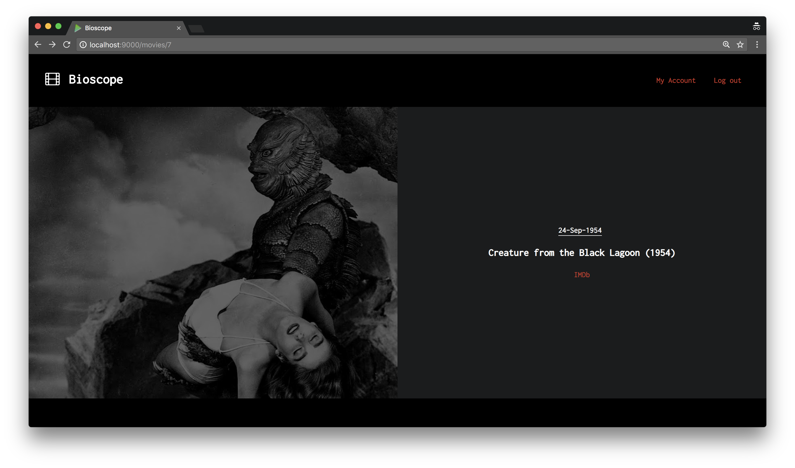

# Bioscope

Bioscope is a small web application running on [Play Framework](https://www.playframework.com) which recommends the best matched movies for a user based on their past ratings. 

* Existing movie, rating and user data is read in and adapted from [MovieLens](https://movielens.org/info/about).
* Users can make ratings for a movie between the range of -5 and 5.
* Movie recommendations are updated based on all ratings made by the user.

## Usage

Assuming installation of Play (1.4.*)

* `git clone git@github.com:dimitraz/bioscope.git`

* `cd to/repo/`

* `play run` 

Online example using small data set at [bioscope.herokuapp.com](http://bioscope.herokuapp.com). To log in, just sign up first. No users are saved. 

## Design

